<div align="center">



# arin

**An annotation layer any agent can draw on.**

Arin is a local daemon that draws on your screen. Point at things, highlight regions,
write explanations. Any AI can drive it over MCP or a small JSON protocol.

It draws. It never clicks.

</div>

---

## What it does

An agent explaining an article can circle each section as it talks about it. An agent
reviewing your code can point at the line it means. A tutorial agent can show you where
a button is instead of describing it.

Arin holds no model and makes no decisions. The intelligence is your agent. Arin is the
chalk.

## Why draw only

Arin never synthesises input. No clicks, no keystrokes, no scrolling. That boundary is
the point: a tool that can only render pixels is safe to leave running, needs no
Accessibility permission, and is auditable in an afternoon. Agents that need to act
should compose Arin with a separate actuator.

## Status

Pre-release, and honest about it. The protocol, the daemon, the session and annotation
state machine, and the socket server all work today. The macOS renderer does not exist
yet, so nothing is drawn on screen.

You can run the whole thing headless and drive it over the socket:

```
git clone https://github.com/your-org/arin && cd arin
cargo run --bin arin -- daemon --headless
```

Then from another shell:

```
cargo run --bin arin -- point 412 88 --display 1 --label Save
```

The annotation is created, acked, and cleared exactly as it will be once there is a
renderer. See the roadmap for what ships when.

## Use from an agent

```json
{"v":"0.1","type":"session_start","client_name":"claude-code"}
{"v":"0.1","type":"point","x":412,"y":88,"display_id":1,"label":"Save"}
{"v":"0.1","type":"highlight","rect":[100,200,340,90],"display_id":1,"label":"the counterargument"}
{"v":"0.1","type":"session_end"}
```

Clients that can ground coordinates themselves send them directly. Clients that cannot
send a natural language query and Arin resolves it with a pluggable grounding model.

Every coordinate is a logical point paired with an explicit display. Never physical
pixels: a Retina screenshot is 2x the logical size, and mixed-DPI multi-monitor setups
make implicit conversion unrecoverable. Clients working from a screenshot divide by the
scale reported in the ack.

## Platforms

| Platform | Status |
|---|---|
| macOS 14.2+ | in progress, 0.1 |
| Linux, KDE and wlroots | 0.4 |
| Windows | 0.6 |
| Linux, GNOME | not supported, no layer shell |

## Privacy

Arin has no analytics, no accounts, and no network listener. The daemon binds a Unix
domain socket and nothing else. The only egress is an optional grounding model call,
which is explicit and off by default. Local grounding lands in 0.5.

## License

MIT
